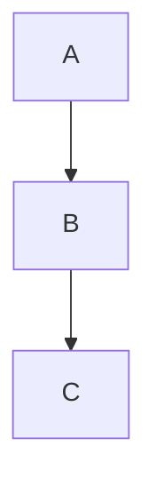

## Babel – Astro Blog Theme

Version: 1.0.0

Babel is a clean, multilingual blog theme for Astro. It emphasizes readability, accessibility, and a friendly authoring experience. You can use it without writing code.

### Live demo

- Add your live site link here once deployed.

### Table of contents

- [What you get](#what-you-get)
- [Quick start (no coding required)](#quick-start-no-coding-required)
- [Make it yours (5 minutes)](#make-it-yours-5-minutes)
- [Write your first post](#write-your-first-post)
  - [Built-in lightweight editor](#built-in-lightweight-editor)
- [Appearance and themes](#appearance-and-themes)
- [Reading progress bar](#reading-progress-bar)
- [Table of Contents](#table-of-contents)
- [Personalize menu](#personalize-menu)
- [Languages (optional)](#languages-optional)
- [Build and preview a production site](#build-and-preview-a-production-site)
- [Deploy your site](#deploy-your-site)
- [Writing extras (MD and MDX)](#writing-extras-md-and-mdx)
- [Tech stack](#tech-stack)
- [Project structure](#project-structure)
- [Command reference](#command-reference)
- [Troubleshooting](#troubleshooting)

### What you get

- Multiple languages with localized routes and feeds
- Easy writing in Markdown (.md) and MDX (.mdx)
- Light, Dark, and System theme modes (with a built‑in switch)
- Search, archive, tags, related posts, and pagination
- Drop‑in themes in `src/themes/`

## Quick start (no coding required)

### 1) Install the tools

- Install Node.js LTS (version 20+). If you don’t have it, download from `https://nodejs.org/`.
- A terminal app is required (Terminal on macOS, Command Prompt/PowerShell on Windows).

### 2) Get the theme files

- Easiest: Download as ZIP from your repository host, unzip, and open the folder.
- Or, if you use Git:

```bash
git clone <your-fork-or-repo-url>
cd babel
```

### 3) Start your site locally

```bash
npm install
echo "PUBLIC_SITE_URL=http://localhost:4321" > .env
npm run dev
```

Open `http://localhost:4321` in your browser. You now have a working blog.

## Make it yours (5 minutes)

- Edit your site’s name and tagline:
  - Open `src/i18n/en.json` and change `site.title` and `site.tagline`.
- Edit your site description (used for SEO by default):
  - The default description comes from the localized `site.tagline` in `src/i18n/<lang>.json`.
  - To customize a specific page/post, pass a `description` prop to the page layout or set `description` in the post front‑matter.
- Choose a default theme:
  - Open `src/config.ts` and set `DEFAULT_THEME` to one of the files in `src/themes` (e.g. `"default"`, `"spring"`).
- Optional social image and logo:
  - Add a file at `public/social.png` for link previews.
  - Replace files in `public/logo/` if you want custom logo assets.
  - Set your site favicon in `src/config.ts`:
    - Add your icon file under `public/` (e.g. `/logo/site-logo.svg`, `/images/favicon.png`, or `/favicon.ico`).
    - Edit `SITE.favicon` in `src/config.ts` to point to your file path. The layout will auto-detect the correct MIME type for `.svg`, `.png`, or `.ico`.

- Author footer blurb (bottom of post):
  - Component: `src/components/AuthorFooter.astro`
  - Content files: `src/content/pages/post-footer.md` (default) and `src/content/<lang>/pages/post-footer.md` for translations (e.g. `src/content/es/pages/post-footer.md`).
  - Used in: `src/components/pages/PostPage.astro` via `<AuthorFooter lang={lang} />`.
  - Customize spacing/style by passing a `class` prop: `<AuthorFooter lang={lang} class="mt-10 text-xs" />`.

## Write your first post

You can create posts in two ways.

### Option A — Built‑in editor (easiest)

```bash
npm run editor
```

Open `http://localhost:3001` in your browser:
- View existing posts
- Create a new post
- Edit front‑matter (title, date, description, tags) and content

Posts are saved to `src/content/posts/`.

### Built-in lightweight editor

Use this if you don’t want to edit files by hand.

1) Start your site (optional but recommended):

```bash
npm run dev
```

2) Start the editor in another terminal:

```bash
npm run editor
```

3) Go to `http://localhost:3001` and:
- Choose a post from the dropdown and click “Load”, or click “New Post”
- Fill in Title, Date, Description, Tags, OG Image, Notes (optional)
- Write your content in the “Body (Markdown)” area
- Click “Save”

Notes:
- The editor manages Markdown (.md) posts in `src/content/posts/`
- Slug and filename are generated from the Title and Date
- OG Image accepts a web path like `/images/og.png` or `/assets/posts/2025/cover.jpg`
- “Notes” supports small footnotes with optional links
- Advanced fields like Canonical URL are supported
- MDX is not supported by the editor (edit MDX files manually)

### Option B — Manually create a Markdown file

Create a file in `src/content/posts/` named like `2025-01-01-my-title.md` with this content:

```yaml
---
title: My first post
description: A short summary (optional)
date: 2025-01-01
tags: [intro]
ogImage: "/images/og.png" # optional
---

Write your post here in Markdown.
```

- Default language posts go in `src/content/posts/`.
- If you add other languages, put translations in `src/content/<lang>/posts/`.

### Add images to posts

- Put images in `public/assets/posts/<year>/` (recommended) or in `public/images/`.
- Reference them in Markdown with paths like `/assets/posts/2025/my-image.jpg`.

## Appearance and themes

- The header includes a mode selector for Light/Dark/System. The user’s choice is saved and synced across tabs.
- Theme files live in `src/themes/`. Change the default by editing `src/config.ts`:

```ts
export const DEFAULT_THEME = "default";
```

## Reading progress bar

Shows a thin bar at the top that fills as the reader scrolls a post.

How it works:
- It’s enabled on post pages by default.
- You can enable it on any page by passing `readingProgress={true}` to the page layout.

Screenshot (replace with your image):


## Table of Contents

Displays a clickable outline of headings on the right on larger screens.

How it works:
- Automatically generated from your post headings (H2/H3) and shown in the sidebar.
- Users can toggle visibility from the Personalize menu.

Screenshot (replace with your image):


## Personalize menu

A small menu in the header lets readers customize their experience.

What readers can change:
- Theme: Light, Dark, or System
- Text size: S / M / L
- Show/Hide Table of Contents

Screenshot (replace with your image):


## Languages (optional)

This theme ships with English (`en`) and Spanish (`es`).

- To keep only English: open `src/config.i18n.ts` and remove any language you don’t want from `SUPPORTED_LANGS`.
- To add a language:

```ts
// src/config.i18n.ts
export const SUPPORTED_LANGS = [
  { code: "en", label: "English" },
  // Add yours:
  { code: "xx", label: "Your Language" },
];
```

Then create `src/i18n/xx.json` with at least:

```json
{ "site.title": "Example Blog", "site.tagline": "A minimal, multilingual Astro blog theme." }
```

If you plan to translate content, add folders:
- Pages: `src/content/xx/pages/`
- Posts: `src/content/xx/posts/`

### Optional: automatic translations

There’s a helper that can translate posts and UI strings using Anthropic Claude.

```bash
# Preview what it would do (no API calls)
npm run prebuild:translate -- --dry-run

# Do real translations during a build (requires a key)
CLAUDE_API_KEY=sk-ant-... npm run build
```

No key? The script safely falls back to stub translations or no‑ops. You can ignore it.

## Build and preview a production site

Before building, set your public site URL. This is required for correct links and SEO.

```bash
echo "PUBLIC_SITE_URL=https://yourdomain.com" > .env
npm run build
npm run preview   # serve the built site locally from dist/
```

Note: If your build injects the wrong URL, open `package.json` → `scripts.build` and replace any hard‑coded URL with one that reads from your `.env` (or update it to match your domain). Then run the build again.

## Deploy your site

The site builds to static files in the `dist/` folder. You can host them anywhere.

- Netlify, Vercel, Cloudflare Pages:
  - Build command: `npm run build`
  - Publish directory: `dist`
  - Environment variable: `PUBLIC_SITE_URL=https://yourdomain.com`
- GitHub Pages:
  - Build locally, then publish the contents of `dist/` to your `gh-pages` branch, or use a CI workflow.
- Any web host:
  - Upload the contents of `dist/` to your server.

Advanced: there’s a sample deploy script at `scripts/deploy.sh` that syncs the built site to another local folder. Edit it before using.

## Writing extras (MD and MDX)

- Mermaid diagrams in Markdown:

```md

```

- Math/KaTeX: already configured via `remark-math` and `rehype-katex`. Use `\( inline \)` and `\[ block \]` syntax.
- Vega‑Lite charts (MDX only):

```mdx
```vega-lite
{ "data": { "values": [{"x": "A", "y": 10}] }, "mark": "bar", "encoding": { "x": {"field": "x", "type": "nominal"}, "y": {"field": "y", "type": "quantitative"} } }
```
```

If your setup complains about a missing component, add to the top of your MDX:

```mdx
import VegaChart from '/src/components/VegaChart'
```

Images in post content zoom on click and keep accessible alt text.

## Command reference

| Command | What it does |
| ------- | ------------- |
| `npm run dev` | Start the local site at `http://localhost:4321` |
| `npm run editor` | Open the simple post editor at `http://localhost:3001` |
| `npm run build` | Create a production build in `dist/` |
| `npm run preview` | Serve the built site from `dist/` locally |
| `npm run prebuild:translate` | Optional translation helper (dry‑run by default) |
| `npm run lint` | Check code style (optional) |
| `npm run format` | Check formatting (optional) |

## Troubleshooting

- "Command not found: node" — Install Node.js from `https://nodejs.org/` and restart your terminal.
- "Missing PUBLIC_SITE_URL" during build — Create a `.env` file with `PUBLIC_SITE_URL=https://yourdomain.com`.
- The site doesn’t show my new title/tagline — Edit `src/i18n/en.json` (`site.title`, `site.tagline`).
- Images don’t load — Make sure the path starts with `/assets/...` or `/images/...` and the file is inside `public/`.
- I don’t need multiple languages — Open `src/config.i18n.ts` and keep only `{ code: "en", label: "English" }`.
- I’m on Windows and environment variables don’t work in commands — Use the `.env` file method.

---

This theme requires `PUBLIC_SITE_URL` to be set at build time. Advanced features (like automated translation) are optional.

## Tech stack

- Astro 5 (content collections, MD/MDX)
- Tailwind CSS 4
- React islands (for search overlay and charts)
- Mermaid, KaTeX (math), Vega‑Lite (charts in MDX)

## Project structure

```
babel/
  public/              # Static assets served as‑is (images, logo, social.png)
  src/
    content/           # Your posts and pages (Markdown/MDX)
    components/        # UI pieces (header, footer, lists, search)
    layouts/           # Page layout
    pages/             # Route files (Astro)
    i18n/              # Language strings (en.json, es.json, ...)
    themes/            # Theme CSS files (default.css, spring.css, ...)
    services/          # Search and related posts logic
    utils/             # Helpers (dates, URLs, etc.)
  scripts/             # Helpers (deploy, translate)
```

Layout inspired by community Astro templates such as the free-astro-template’s clear sectioning of demo, stack, and structure. See the referenced README for layout ideas: [free-astro-template README](https://github.com/guihubie/free-astro-template/blob/main/README.md).

## More features you get automatically

- Spotlight search overlay: press `/` or `⌘K / Ctrl+K` to open from any page
- Personalize menu: change theme (Light/Dark/System), text size (S/M/L), and show/hide Table of Contents
- RSS feeds and sitemap: generated automatically (with language variants when enabled)
- Related posts: simple “You may also like” suggestions based on content and tags
- Back‑to‑top button: appears after you scroll a bit
- Code blocks: copy‑to‑clipboard button and language badge labels
- Accessibility: keyboard‑friendly UI, skip‑to‑content link, reduced‑motion‑aware page transitions