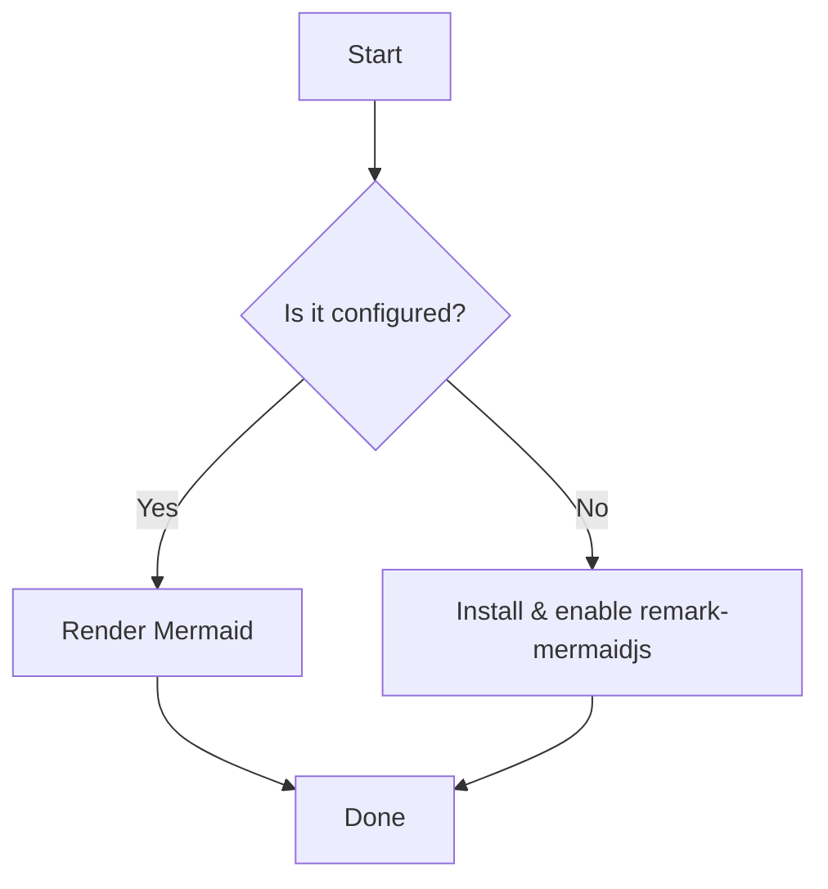

import VegaChart from '/src/components/VegaChart'

This is a sample post included with the theme. Replace it with your own content. It demonstrates common Markdown elements.

## Headings

# Heading 1 (H1)
## Heading 2 (H2)
### Heading 3 (H3)
#### Heading 4 (H4)
##### Heading 5 (H5)
###### Heading 6 (H6)

> Note: In most blog layouts, the main page title is already an H1. Additional H1s are shown here only for demonstration.

## Text styles

Regular text, with **bold** emphasis and *italic* emphasis. You can also combine them as ***bold italics*** and include `inline code` when needed.

Links look like this: [Learn more about this theme](/about/).

## Lists

- Unordered list item
- Another item
  - Nested item
  - Nested item

1. Ordered list item
2. Another item
   1. Nested item
   2. Nested item

## Blockquote

> A blockquote can be used to highlight an excerpt, tip, or important note.

## Code blocks

```js
function greet(name) {
  console.log(`Hello, ${name}`);
}
greet('World');
```

```bash
npm install
npm run dev
```

## Images


You can add captions with simple text under the image. Remember to include helpful alt text.

---

That’s it! This post covers headings, text styles, lists, blockquotes, code, and images.

## Mermaid diagram



## Math (KaTeX)

Inline math uses \( ... \): \(E = mc^2\).

Block math uses \[ ... \]:

\[\int_0^1 x^2\,dx = \frac{1}{3}\]

## Vega-Lite chart

```vega-lite
{
  "$schema": "https://vega.github.io/schema/vega-lite/v5.json",
  "width": 300,
  "height": 150,
  "data": {
    "values": [
      {"category": "A", "amount": 28},
      {"category": "B", "amount": 55},
      {"category": "C", "amount": 43}
    ]
  },
  "mark": "bar",
  "encoding": {
    "x": {"field": "category", "type": "nominal", "axis": {"title": null}},
    "y": {"field": "amount", "type": "quantitative", "axis": {"title": null}}
  }
}
```
